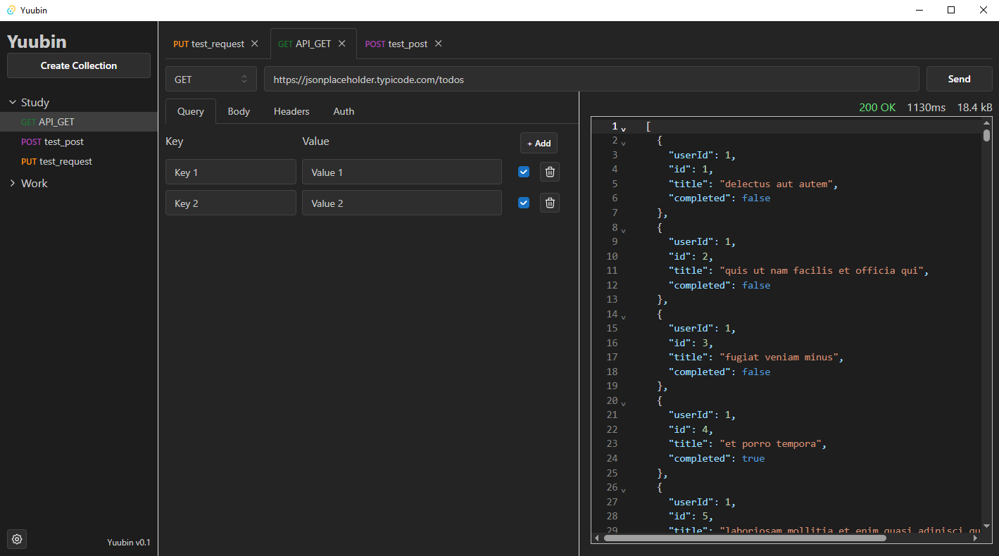

# Yuubin

Yuubin is a powerful and user-friendly API client desktop application, similar to Postman, that allows you to create, manage, and test HTTP requests. Unlike some other API clients, Yuubin stores all collection and request data locally on your computer in files, ensuring your data remains private and secure. Yuubin is built using Tauri, making it lightweight and fast.




## Features

- **Local Data Storage:** All your collections, requests and configs are stored locally on your computer in files, ensuring your data remains private and secure.
- **User-Friendly Interface:** An intuitive and easy-to-use interface for creating, managing, and testing HTTP requests.
- **Request Collections:** Organize your requests into collections for better management and ease of access.
- **Customizable Requests:** Create and customize HTTP requests with various methods (GET, POST, PUT, DELETE, etc.), headers, and body parameters.
- **Response Viewing:** View detailed responses, including status codes and response bodies. (Response headers currently in development)
- **Customizable UI:** Switch between dark and light themes, and choose between Japanese and English language options.

## Installation

To install Yuubin, follow these steps:

1. Clone the repository and navigate to the project directory:
    ```bash
    git clone https://github.com/JackMartinDev/Yuubin.git
    cd Yuubin
    ```
2. Install the dependencies:
    ```bash
    yarn install
    ```
3. Build the Tauri application:
    ```bash
    yarn tauri build
    ```
4. Install Yuubin based on your operating system:
    - **Windows:** Run the `.msi` or `.exe` installer.
    - **MacOS:** Open the `.app` or `.dmg` file.
    - **Linux:** Use the `.deb` or `.AppImage` file.

   You can find the installation files in the distribution directory: `src-tauri\target\release\bundle`.

## Getting Started

1. **Creating a New Collection:**
   - Click on the "Create Collection" button on the left side of the application.
   - Enter a name for your collection and save it.

2. **Adding Requests to a Collection:**
   - Click on the "New Request" button within the desired collection.
   - Save the request to your collection.
   - Enter the request details (method, URL, headers, body).
   - Click "Send" to execute the request and view the response.

## License

This project is licensed under the MIT License - see the [LICENSE](LICENSE) file for details.

## Acknowledgements

- Inspired by Postman.
- Built using [Tauri](https://tauri.app/).
